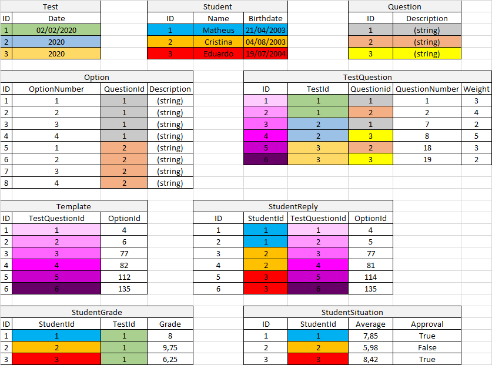

# DESAFIO_Escola-ALF (2021)
## Descrição do projeto
 Neste repositório há uma API RESTful criada com o intuito de responder a um desafio de um processo seletivo.
 A API foi desenvolvida com a linguagem de programação C#, utilizando o editor de código-fonte Visual Studio Code. 
 Para a disponibilização dos dados foi utilizado o Framework ASP.NET Core.
 Para criar as requisições foi utilizada a ferramenta Postman, que tem como objetivo testar serviços de WEB APIs por meio do envio de requisições HTTP, sendo possível avaliar as respostas das requisições. 

## Sumário
* [Critérios](#Critérios)
* [Como rodar a aplicação](#Como-rodar-a-aplicação)
* [Como rodar os testes unitários](#Como-rodar-os-testes-unitários)
* [Ideia das tabelas](#Ideia-das-tabelas)
* [Pacotes utilizados](#Pacotes-utilizados)
* [Comandos utilizados](#Comandos-utilizados)
* [Funcionamento da API](#Funcionamento-da-API)
    * [Efetuação das restrições](#Efetuação-das-restrições)
    * [Endpoints](#Endpoints)
        * [Student (Estudante)](#Student-Estudante)
        * [Template (Gabarito)](#Template-Gabarito)
        * [StudentReply (Resposta)](#StudentReply-Resposta)
        * [StudentGrade (Nota)](#StudentGrade-Nota)
        * [StudentSituation (Situação)](#StudentSituation-Situação)


## Critérios
 ### O Desafio

 A escola Alf aplica provas de múltipla escolha para os alunos. A nota do aluno na prova é determinada pela média ponderada das questões com os pesos de cada questão. Cada questão correta soma 1 ponto multiplicada pelo peso e cada questão errada 0. A nota final é a média aritmética das notas de todas as provas.

 ### Requisitos obrigatórios:

 Crie uma API HTTP que permita à escola: 

 - Cadastrar o gabarito de cada prova;
 - Cadastrar as respostas de cada aluno para cada prova;
 - Verificar a nota final de cada aluno;
 - Listar os alunos aprovados;

 Restrições
 - A nota total da prova é sempre maior que 0 e menor que 10.
 - A quantidade máxima de alunos é 100.
 - O peso de cada questão é sempre um inteiro maior que 0.
 - Os alunos aprovados tem média de notas maior do que 7.
 - A entrada e saída de dados deverá ser em JSON.

## Como rodar a aplicação
 Para executar a API através do Visual Studio Code, basta abrir o Terminal com a combinação de teclas `Ctrl + Shift + '` ou `Ctrl + '`, selecionar a pasta "EscolaAlf_API" com o comando `cd` e a tecla `TAB` e digitar o seguinte comando:
 ```
 dotnet run
 ```
 ou
 ```
 dotnet watch run
 ```

## Como rodar os testes unitários
 Para desempenhar os testes unitários do diretório `BackEnd/UnitTesting/Calculation.tests` através do Visual Studio Code, basta abrir o Terminal com a combinação de teclas `Ctrl + Shift + '` ou `Ctrl + '`, selecionar a pasta "EscolaAlf_API" com o comando `cd` e a tecla `TAB` e digitar o seguinte comando:
 ```
 dotnet test
 ```

## Ideia das tabelas
 

## Pacotes utilizados
 - Microsoft.EntityFrameworkCore
 - Microsoft.EntityFrameworkCore.SqlServer
 - Microsoft.EntityFrameworkCore.Design
 - Microsoft.EntityFrameworkCore.Tools
 - Microsoft.EntityFrameworkCore.Analyzers
 - Microsoft.AspNetCore.Mvc.NewtonsoftJson --version 3.1.7
 - NUnit --version 3.12.0  
  
 Os pacotes do EntityFrameworkCore foram usados para desenvolver a API;  
 O pacote NewtonsoftJson foi empregado para impedir ciclos incessantes ao receber respostas da API;  
 O pacote NUnit foi utilizado para realizar testes unitários nas classes de cálculo de média ponderada e média aritmética.

## Comandos utilizados
 Todos os comandos usados para desenvolver a API:
 ```
 dotnet new webapi -n EscolaAlf_API
 cd EscolaAlf_API
 dotnet add package Microsoft.EntityFrameworkCore
 dotnet add package Microsoft.EntityFrameworkCore.SqlServer
 dotnet add package Microsoft.EntityFrameworkCore.Design
 dotnet add package Microsoft.EntityFrameworkCore.Tools
 dotnet add package Microsoft.EntityFrameworkCore.Analyzers
 dotnet add package Microsoft.AspNetCore.Mvc.NewtonsoftJson --version 3.1.7
 dotnet tool install --global dotnet-ef
 dotnet ef migrations add InitialMigration
 dotnet ef database update
 dotnet build
 dotnet watch run 
```

### TESTES UNITÁRIOS:
```
 cd EscolaAlf_API
 dotnet add package NUnit --version 3.12.0
 dotnet new sln -n EscolaAlf_API
 dotnet sln EscolaAlf_API.sln add EscolaAlf_API.csproj
 cd ..
 cd UnitTesting
 dotnet new nunit -n Calculation.tests
 cd ..
 cd EscolaAlf_API
 dotnet sln EscolaAlf_API.sln add ../UnitTesting/Calculation.tests/Calculation.tests.csproj
 dotnet add ../UnitTesting/Calculation.tests/Calculation.tests.csproj reference EscolaAlf_API.csproj
 dotnet test
 ```

# Funcionamento da API
Este tópico tem a função de explicar como efetuar a comunicação com a API através da apresentação dos Endpoints. Também há a demonstração dos recursos usados no código para efetuar as restrições citadas no desafio.  

### Observações:
Para poder cadastrar gabaritos e respostas é necessária a existência de instâncias da tabela `TestQuestion` que realizam a relação entre a tabela `Test` e a tabela `Question`. A partir dessa tabela, o usuário poderá escolher quantas e quais questões uma prova terá e qual será a ordem delas;  
  
Para cadastrar um gabarito na tabela `Template` o usuário deverá escolher uma opção da tabela `Option`. Essa opção será a alternativa correta que o estudante deverá selecionar em uma questão para acertá-la;  
  
Para cadastrar uma resposta na tabela `StudentReply` o usuário deverá ter instâncias das tabelas `Option` e `Student`. As instâncias desta representarão os estudantes da escola;  
  
Para cadastrar notas na tabela `StudentGrade` é necessária a existência de instâncias das tabelas `Template` e `StudentReply`;  
  
Para cadastrar situações na tabela `StudentSituation` é necessária a existência de instâncias da tabela `StudentGrade`;  
  
Há instâncias padrões na classe contexto, cujo diretório é: `BackEnd/EscolaAlf_API/Data/DataContext.cs`;  
  
Toda entrada e saída de dados é em JSON.

## Efetuação das restrições
### - A nota total da prova é sempre maior que 0 e menor que 10.
OBS: Decidi considerar que a nota é sempre maior ou igual a 0 e menor ou igual a 10.  
  
Diretório: `BackEnd/EscolaAlf_API/Models/StudentGrade.cs`  
  
Código:
```c#
[Range(0, 10, ErrorMessage = "Value for grade must be between 0 and 10.")]
public double Grade { get; set; }
```
### - A quantidade máxima de alunos é 100.
OBS: Condição adicionada dentro do método `[HttpPost]` do `StudentController.cs`.  
  
Diretório: `BackEnd/EscolaAlf_API/Controllers/StudentController.cs`  
  
Código:
```c#
if (_iStudent.ReturnNumberOfStudents() >= 100)
{
    return BadRequest("The number of students must be less than 100!");
}
```
### - O peso de cada questão é sempre um inteiro maior que 0.
OBS: O valor de peso foi limitado a 1000.  
  
Diretório: `BackEnd/EscolaAlf_API/Models/TestQuestion.cs`  
  
Código:
```c#
[Range(1, 1000, ErrorMessage = "Value for weight must be between 1 and 1000.")]
public int Weight { get; set; }
```
### - Os alunos aprovados tem média de notas maior do que 7.
OBS: Decidi considerar que os alunos aprovados têm média sempre maior ou igual a 7. A condição foi adicionada dentro do método `[HttpPost]` do `StudentSituationController.cs`.  
  
Diretório: `BackEnd/EscolaAlf_API/Controllers/StudentSituationController.cs`  
  
Código:
```c#
if (average >= 7)
{
    StudentSituation studentSituation = new StudentSituation(0, studentId, average, true);
    _repository.Add(studentSituation);
    if (await this._repository.SaveChangesAsync() != true)
    {
        return BadRequest();
    }
    return Ok(studentSituation);
}
```

## Endpoints
### Student (Estudante)
Obter todos os estudantes:
```json
"name": "Get",
"request": {
    "method": "GET",
    "url": {
        "raw": "https://localhost:5001/Student"
    }
}
```

Obter o estudante pelo id:
```json
"name": "GetById",
"request": {
    "method": "GET",
    "url": {
        "raw": "https://localhost:5001/Student/id=1"
    }
}
```

Postar um estudante:
```json
"name": "Post",
"request": {
    "method": "POST",
    "body": {
        "mode": "raw",
        "raw": "{\r\n    \"name\": \"Eduarda\",\r\n    \"birthdate\": \"2003-09-19T00:00:00\"\r\n}"
    },
    "url": {
        "raw": "https://localhost:5001/Student/"
    }
}
```

Editar um estudante:
```json
"name": "Put",
"request": {
    "method": "PUT",
    "body": {
        "mode": "raw",
        "raw": "{\r\n    \"id\": 6,\r\n    \"name\": \"Eduardo\",\r\n    \"birthdate\": \"2003-09-19T00:00:00\"\r\n}"
        }
    },
    "url": {
        "raw": "https://localhost:5001/Student/id=6"
    }
```

Remover um estudante:
```json
"name": "Delete",
"request": {
    "method": "DELETE",
    },
    "url": {
        "raw": "https://localhost:5001/Student/id=6"
    }
```

### Template (Gabarito)
Obter todos os gabaritos:
```json
"name": "Get",
"request": {
    "method": "GET"
    },
    "url": {
        "raw": "https://localhost:5001/Template"
    }
```

Obter o gabarito pelo id:
```json
"name": "GetById",
"request": {
    "method": "GET"
    },
    "url": {
        "raw": "https://localhost:5001/Template/id=1"
    }
```

Postar um gabarito:
```json
"name": "Post",
"request": {
    "method": "POST",
    "body": {
        "mode": "raw",
        "raw": "{\r\n    \"testQuestionId\": 1,\r\n    \"optionId\": 1\r\n}"
        }
    },
    "url": {
        "raw": "https://localhost:5001/Template"
    }
```

Editar um gabarito:
```json
"name": "Put",
"request": {
    "method": "PUT",
    "body": {
        "mode": "raw",
        "raw": "{\r\n    \"id\": 3,\r\n    \"testQuestionId\": 5,\r\n    \"optionId\": 1\r\n}"
        }
    },
    "url": {
        "raw": "https://localhost:5001/Template/id=3"
    }
```

Remover um gabarito:
```json
"name": "Delete",
"request": {
    "method": "DELETE"
    },
    "url": {
        "raw": "https://localhost:5001/Template/id=2"
    }
```

### StudentReply (Resposta)
Obter todas as respostas:
```json
"name": "Get",
"request": {
    "method": "GET"
    },
    "url": {
        "raw": "https://localhost:5001/StudentReply"
    }
```

Obter resposta pelo id:
```json
"name": "GetById",
"request": {
    "method": "GET"
    },
    "url": {
        "raw": "https://localhost:5001/StudentReply/id=43"
    }
```

Obter respostas pelo id do estudante:
```json
"name": "GetByStudentId",
"request": {
    "method": "GET"
    },
    "url": {
        "raw": "https://localhost:5001/StudentReply/studentid=2"
    }
```

Postar uma resposta:
```json
"name": "Post",
"request": {
    "method": "POST",
    "body": {
        "mode": "raw",
        "raw": "{\r\n    \"studentId\": 2,\r\n    \"testQuestionId\": 1,\r\n    \"optionId\": 1\r\n}"
        }
    },
    "url": {
        "raw": "https://localhost:5001/StudentReply"
    }
```

Editar uma resposta:
```json
"name": "Put",
"request": {
    "method": "PUT",
    "body": {
        "mode": "raw",
        "raw": "{\r\n    \"id\": 44,\r\n    \"studentId\": 1,\r\n    \"testQuestionId\": 2,\r\n    \"testQuestion\": null,\r\n    \"optionId\": 14\r\n}"
        }
    },
    "url": {
        "raw": "https://localhost:5001/StudentReply/id=44"
    }
```

Remover uma resposta:
```json
"name": "Delete",
"request": {
    "method": "DELETE",
    },
    "url": {
        "raw": "https://localhost:5001/StudentReply/id=16"
    }
```

### StudentGrade (Nota)
Obter todas as notas:
```json
"name": "Get",
"request": {
    "method": "GET"
        }
    "url": {
        "raw": "https://localhost:5001/StudentGrade"
    }
```

Obter as notas pelo id do estudante:
```json
"name": "GetByStudentId",
"request": {
    "method": "GET"
    },
    "url": {
        "raw": "https://localhost:5001/StudentGrade/studentid=2"
    }
```

Calcular e postar as notas de um estudante.
Este método utiliza um serviço de cálculo de notas do diretório `BackEnd/EscolaAlf_API/Data/Services/GradeCalculationService.cs`:
```json
"name": "CalculateAndPostGrade",
"request": {
    "method": "POST",
    "body": {
        "mode": "raw",
        "raw": "{\r\n    \"studentId\": 2,\r\n    \"testQuestionId\": 1,\r\n    \"optionId\": 1\r\n}"
        }
    },
    "url": {
        "raw": "https://localhost:5001/StudentGrade/calculategrade_testid=2&studentid=2"
    }
```

Editar uma nota:
```json
"name": "Put",
"request": {
    "method": "PUT",
    "body": {
        "mode": "raw",
        "raw": "{\r\n    \"id\": 11,\r\n    \"testId\": 1,\r\n    \"studentId\": 1,\r\n    \"grade\": 1.0\r\n}"
        }
    },
    "url": {
        "raw": "https://localhost:5001/StudentGrade/id=11"
    }
```

Remover uma nota:
```json
"name": "Delete",
"request": {
    "method": "DELETE"
    },
    "url": {
        "raw": "https://localhost:5001/StudentGrade/id=4"
    }
```

### StudentSituation (Situação)
Obter todas as situações:
```json
"name": "Get",
"request": {
    "method": "GET"
    },
    "url": {
        "raw": "https://localhost:5001/StudentSituation"
    }
```

Obter situações pelo id do estudante:
```json
"name": "GetByStudentId",
"request": {
    "method": "GET"
        }
    "url": {
        "raw": "https://localhost:5001/StudentSituation/studentid=2"
    }
```

Obter os estudantes aprovados:
```json
"name": "GetApproved",
"request": {
    "method": "GET"
    },
    "url": {
        "raw": "https://localhost:5001/StudentSituation/approved"
    }
```

Calcular e postar a situação de um estudante.
Este método utiliza um serviço de cálculo de médias do diretório `BackEnd/EscolaAlf_API/Data/Services/AverageCalculationService.cs`:
```json
"name": "CalculateAndPostAverage",
"request": {
    "method": "POST",
    "body": {
        "mode": "raw",
        "raw": "{\r\n    \"studentId\": 1,\r\n    \"average\": 0,\r\n    \"approval\": false\r\n}"
        }
    },
    "url": {
        "raw": "https://localhost:5001/StudentSituation/calculateaverage_studentid=1"
    }
```

Editar uma situação:
```json
"name": "Put",
"request": {
    "method": "PUT",
    "body": {
        "mode": "raw",
        "raw": "{\r\n    \"id\": 6,\r\n    \"studentId\": 1,\r\n    \"average\": 8.0,\r\n    \"approval\": true\r\n}"
        }
    },
    "url": {
        "raw": "https://localhost:5001/StudentSituation/id=6"
    }
```

Remover uma situação:
```json
"name": "Delete",
"request": {
    "method": "DELETE",
    },
    "url": {
        "raw": "https://localhost:5001/StudentSituation/id=1"
    }
```
