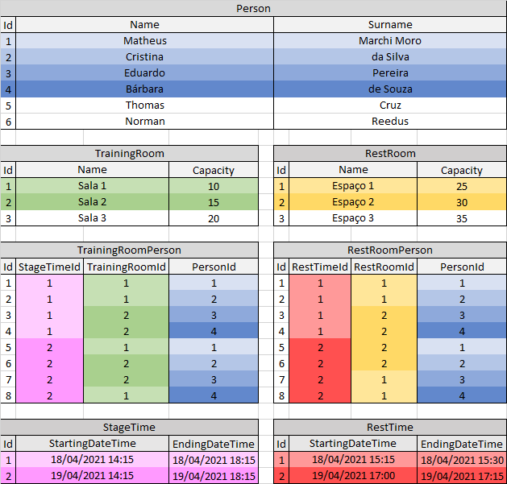

# DESAFIO_Treinamento (2021)
## Descrição do projeto
 Neste repositório há uma API RESTful e um projeto do Angular criados com o intuito de responder a um desafio de um processo seletivo.
 A API foi desenvolvida com a linguagem de programação C#, utilizando o editor de código-fonte Visual Studio Code. 
 Para a disponibilização dos dados foi utilizado o Framework ASP.NET Core.
 Para criar as requisições foi utilizada a ferramenta Postman, que tem como objetivo testar serviços de WEB APIs por meio do envio de requisições HTTP, sendo possível avaliar as respostas das requisições.

## Sumário
* [Critérios](#Critérios)
* [Como rodar a aplicação](#Como-rodar-a-aplicação)
* [Como rodar os testes unitários](#Como-rodar-os-testes-unitários)
* [Pacotes utilizados](#Pacotes-utilizados)
* [Ideia das tabelas](#Ideia-das-tabelas)
* [Explicação das tabelas](#Explicação-das-tabelas)
* [Efetuação das restrições](#Efetuação-das-restrições)
* [Endpoints](#Endpoints)


## Critérios
 ### O Problema

 A ProWay vai realizar um treinamento para uma grande empresa de TI de Blumenau, especializada em softwares de gestão. O treinamento será realizado em 2 etapas e as pessoas serão divididas em salas com lotação variável. Serão realizados também dois intervalos de café em 2 espaços distintos. Você precisa criar o sistema que gerenciará este evento.

 ### O sistema precisa permitir:

- O cadastro de pessoas, com nome e sobrenome;
- O cadastro das salas do evento, com nome e lotação;
- O cadastro dos espaços de café pelo nome;
  
 A diferença de pessoas em cada sala deverá ser de no máximo 1 pessoa. Para estimular a troca de conhecimentos, metade das pessoas precisam trocar de sala entre as duas etapas do treinamento.
 Ao consultar uma pessoa cadastrada no treinamento, o sistema deverá retornar a sala em que a pessoa ficará em cada etapa e o espaço onde ela realizará cada intervalo de café.
 Ao consultar uma sala cadastrada ou um espaço de café, o sistema deverá retornar uma lista das pessoas que estarão naquela sala ou espaço em cada etapa do evento.

### Requisitos obrigatórios:

 Crie uma interface que permita: 

- O cadastro de pessoas, com nome e sobrenome;
- O cadastro das salas do evento, com nome e lotação;
- O cadastro dos espaços de café com lotação;
- A consulta de cada pessoa;
- A consulta de cada sala e espaço;

### Requisitos desejáveis:
- Persistência de dados;
- Testes unitários;

## Como rodar a aplicação

 Antes de tudo, é preciso ter o SQL Server, o .NET Framework e o .NET Core instalados em seu computador. A API utiliza esses serviços para funcionar e para gerenciar um banco de dados.
  
 Depois de baixar os programas necessários, é preciso configurar a conexão com o banco de dados SQL no diretório `BackEnd/Training_API/appsettings.json` e na chave "Connection", cujo valor será a string de conexão. Para isso, crie um bloco de notas na área de trabalho e o salve como um arquivo .udl. Ao abrir esse arquivo udl, você conseguirá configurar a conexão. Depois de configurada, basta abrir o mesmo arquivo com o bloco de notas e terás a string de conexão.
  
 Para executar a API através do Visual Studio Code, deve-se abrir o Terminal com a combinação de teclas `Ctrl + Shift + '` ou `Ctrl + '`, selecionar a pasta "Training_API" no diretório "BackEnd" com o comando `cd` e a tecla `TAB` e digitar os seguintes comandos:
 ```
 dotnet tool install --global dotnet-ef
 dotnet ef database update
 dotnet run
```
  
 Antes de iniciar o projeto do Angular, deve-se instalar o Node.js
  
 Após isso, no Visual Studio Code, necessita-se abrir outro Terminal, utilizar o comando `cd` e a tecla `TAB` para selecionar a pasta "Training" no diretório "FrontEnd" e digitar os seguintes comandos:
 ```
 npm install -g @angular/cli
 npm update
 npm start
 ```
  
 Caso dê erro ao executar 'npm' no terminal, adicione o diretório do Node às Variáveis de Ambiente de seu computador e reinicie-o.
  
 Após essas etapas, a API e o Angular estarão rodando ao mesmo tempo, e você poderá acessar o programa através do link `http://localhost:4200` em seu navegador.

## Como rodar os testes unitários
 Para desempenhar os testes unitários do diretório `BackEnd/UnitTesting/Verification.tests` através do Visual Studio Code, basta abrir o Terminal com a combinação de teclas `Ctrl + Shift + '` ou `Ctrl + '`, selecionar a pasta "Training_API" com o comando `cd` e a tecla `TAB` e digitar o seguinte comando:
 ```
 dotnet test
 ```

## Pacotes utilizados
 BackEnd:
 - Microsoft.EntityFrameworkCore
 - Microsoft.EntityFrameworkCore.SqlServer
 - Microsoft.EntityFrameworkCore.Design
 - Microsoft.EntityFrameworkCore.Tools
 - Microsoft.EntityFrameworkCore.Analyzers
 - Microsoft.AspNetCore.Mvc.NewtonsoftJson --version 3.1.7
 - NUnit --version 3.12.0  
  
 FrontEnd:
 - Bootstrap
 - NGX-Bootstrap
  
 Os pacotes do EntityFrameworkCore foram usados para desenvolver a API;  
 O pacote NewtonsoftJson foi empregado para impedir ciclos incessantes ao receber respostas da API;  
 O pacote NUnit foi utilizado para realizar testes unitários na classe de verificação de listas na API;
 Os pacotes do FrontEnd foram recorridos com o intuito de estilizar as páginas HTML.

## Ideia das tabelas
 

## Explicação das tabelas
### Person, Training-Room, Rest-Room, Stage-Time e Rest-Time
 Estas tabelas armazenam as informações das pessoas, salas de treinamento, salas de descanso (para os intervalos), horários das etapas e horário dos intervalos, respectivamente.

### Training-Room-Person
 Esta tabela relaciona as tabelas Person, Training-Room e Stage-Time. Ela associa uma pessoa a uma sala de treinamento e também armazena o horário que essa pessoa comparecerá a tal sala.

### Rest-Room-person
 Semelhante à tabela anterior, esta relaciona as tabelas Person, Rest-Room e Rest-Time. Ela associa uma pessoa a uma sala de descanso (para realizar o intervalo) e também armazena o horário que essa pessoa comparecerá a tal sala.

## Efetuação das restrições
### IMPORTANTE:
 Para observar as restrições atuando nas tabelas Training-Room-Person e Rest-Room-Person, é preciso inspecionar elemento em seu navegador e observar o CONSOLE. Se uma restrição for violada, quem notificará será o CONSOLE do navegador.

### 1 - A diferença de pessoas em cada sala deverá ser de no máximo 1 pessoa.
 Para esta restrição foi criada uma função na classe de verificação na pasta Services da API que recebe uma lista da quantidade de alunos em cada sala e retorna TRUE caso a diferença na quantidade for maior que um.  
 Diretório: `BackEnd/Training_API/Data/Services/Verification/VerificationService.cs`
 ```c#
 public bool VerifyDifferenceOfOne(List<int> list)
    {
        int maxValue = list.Max<int>();
        int minValue = list.Min<int>();
        if ((maxValue - minValue) > 1)
        {
            return true;
        }
        else
        {
            return false;
        }
    }
 ```
  
 OBS: Também foi adicionada uma função na mesma classe que recebe a capacidade de uma sala e a quantidade de pessoas nela e retorna TRUE caso a sala já esteja lotada.
 ```c#
 public bool VerifyPeopleExcess(int roomCapacity, int peopleQuantity)
    {
        if (peopleQuantity > roomCapacity)
        {
            return true;
        }
        else
        {
            return false;
        }
    }
 ```

### 2 - Ao consultar uma pessoa cadastrada no treinamento, o sistema deverá retornar a sala em que a pessoa ficará em cada etapa e o espaço onde ela realizará cada intervalo de café.
 Para esta restrição, a função do serviço da tabela Person que retorna uma consulta pelo Id recebeu os métodos `.Include()` e `.ThenInclude()` que adicionam à consulta os itens exigidos pela restrição.  
 Diretório: `BackEnd/Training_API/Data/Services/PersonService.cs`
 ```c#
 public async Task<Person> GetByIdAsync(int personId, bool includeRooms)
    {
        IQueryable<Person> query = _context.Person;
        if (includeRooms)
        {
            query = query.Include(p => p.TrainingRoomPeople)
                            .ThenInclude(trp => trp.TrainingRoom);
            query = query.Include(p => p.TrainingRoomPeople)
                            .ThenInclude(trp => trp.StageTime);
            query = query.Include(p => p.RestRoomPeople)
                            .ThenInclude(rrp => rrp.RestRoom);
            query = query.Include(p => p.RestRoomPeople)
                            .ThenInclude(rrp => rrp.RestTime);
        }
        query = query.AsNoTracking().Where(p => p.Id == personId);
        return await query.FirstOrDefaultAsync();
    }
 ```

### 3 - Ao consultar uma sala cadastrada ou um espaço de café, o sistema deverá retornar uma lista das pessoas que estarão naquela sala ou espaço em cada etapa do evento.
 Semelhante à restrição anterior, as funções dos serviços das tabelas Training-Room e Rest-Room que retornam consultas pelo Id receberam os métodos `.Include()` e `.ThenInclude()` que adicionam às consultas uma lista de pessoas.
  
 Rest-Room:  
 Diretório: `BackEnd/Training_API/Data/Services/RestRoomService.cs`
 ```c#
 public async Task<RestRoom> GetByIdAsync(int restRoomId, bool includePeople)
    {
        IQueryable<RestRoom> query = _context.RestRoom;
        if (includePeople)
        {
            query = query.Include(rr => rr.RestRoomPeople)
                            .ThenInclude(rrp => rrp.Person);
        }
        query = query.AsNoTracking().Where(p => p.Id == restRoomId);
        return await query.FirstOrDefaultAsync();
    }
 ```
  
 Training-Room:  
 Diretório: `BackEnd/Training_API/Data/Services/TrainingRoomService.cs`
 ```c#
 public async Task<TrainingRoom> GetByIdAsync(int trainingRoomId, bool includePeople)
    {
        IQueryable<TrainingRoom> query = _context.TrainingRoom;
        if (includePeople)
        {
            query = query.Include(tr => tr.TrainingRoomPeople)
                            .ThenInclude(trp => trp.Person);
        }
        query = query.AsNoTracking().Where(tr => tr.Id == trainingRoomId);
        return await query.FirstOrDefaultAsync();
    }
 ```

## Endpoints
 Diretório: `BackEnd/Endpoints`
